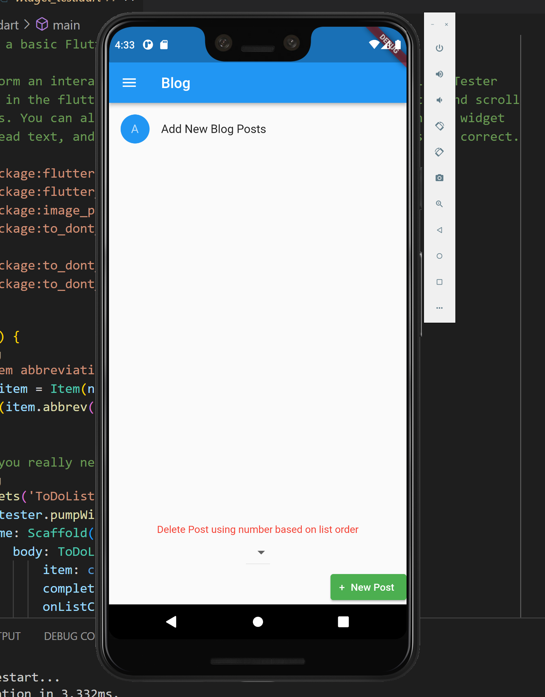
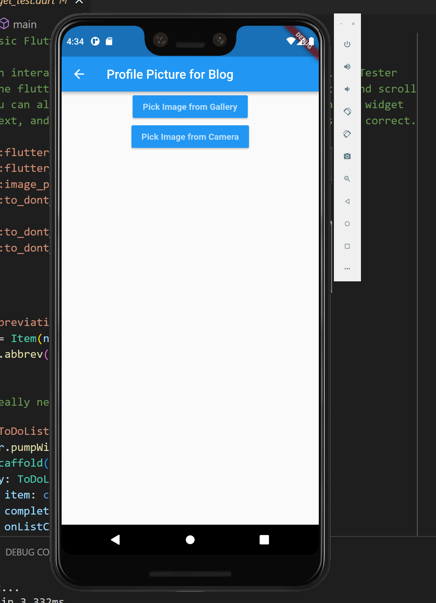
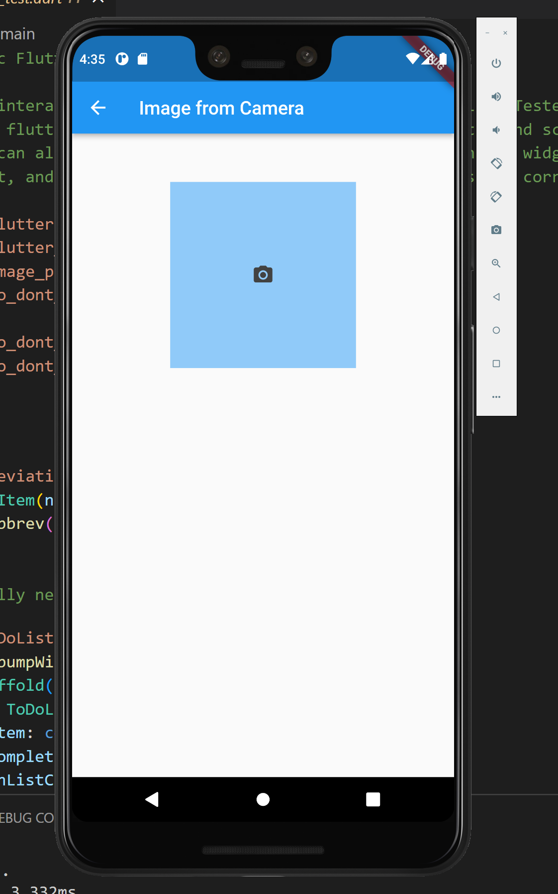

# Blog and Profile Picture App

Project 2 - To Don't List Demo from forked repository

## Who is the audience for this app

This can be used by any person who is looking to store their blog posts on their mobile phone. Developers welcome to contribute to this app and improve its basic functionality.

## What the app does

This app allows the user to store blog posts on their phone as well as add/update a profile picture using the image picker packages through Flutter.

## Why the app is useful

If you ever desired a free app that could store blog posts and upload photos or even want to use some of this code for your own projects, then you will find this app quite useful.

## Multiple Screenshots of your app

